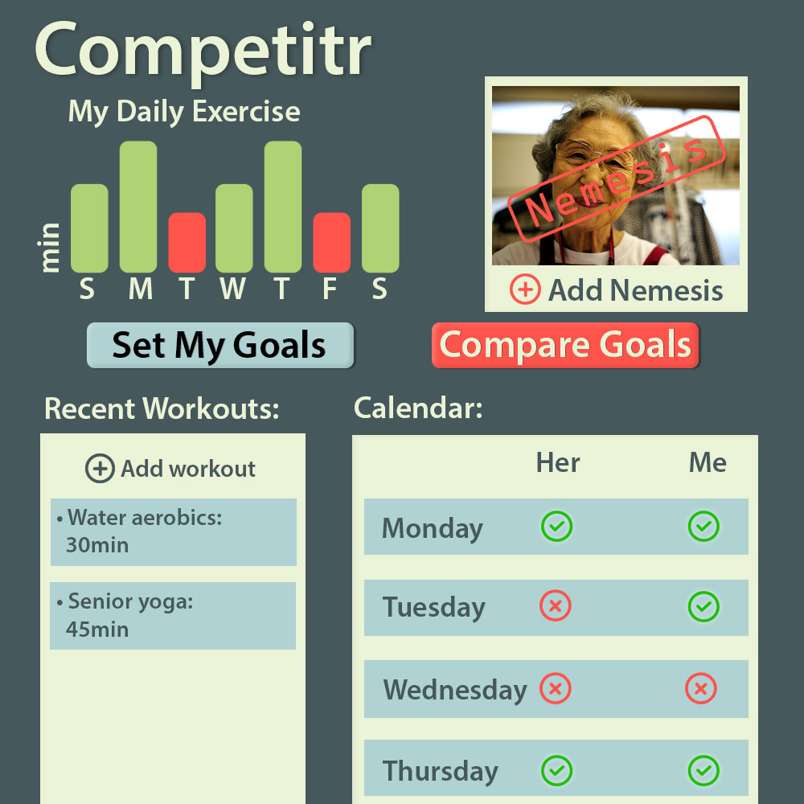

# Design Hackathon

## Competitr

### Synopsis

For this challenge, we had 2.5 hours to build a static comp given to us by another team. Competitr is an app that was designed for a 74 year old persona. It is an app made so that older people can compare how much they work out with their friends. All of the fonts and buttons were made with a large font so that someone could read it with no problem. 

### Wireframe

Desktop Layout

Mobile Layout 

### Our Layout
